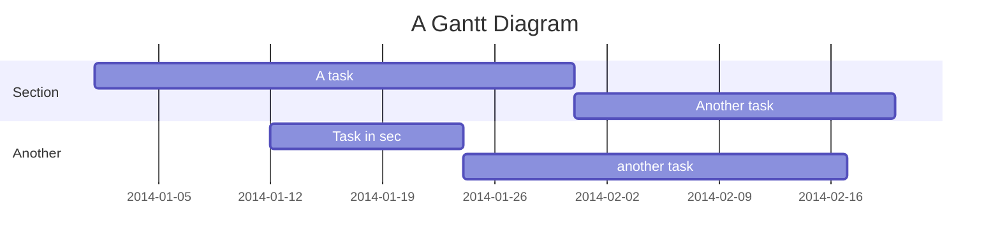

# 파일 확장자 차단 요구사항 정의서

## 1. 개요

파일 확장자에 따라 특정 형식의 파일을 첨부하거나 전송하지 못하도록 제한하는 API

## 2. 일정(간트 차트)

### 요구사항

- bat, cmd, com, cpl, exe, scr, js 리스트는 고정적으로 존재해야한다
  이는 확장자 테이블에 생성

확장자 테이블은 활성화 / 비활성화 컬럼을 통해 관리되어야 한다
고정 확장자와 커스텀 확장자 또한 컬럼으로 관리한다
중요점 - 확장자를 분리해서 관리하지 않는다
또한 확장자 로그 테이블을 만들어 (확장자 1 : N 로그)
언제 누가(요청 IP) 활성화했는지 비활성화했는지에 대한 최소한의 정보를 기록

데이터를 로드 할 때 활성화 되어 있는 모든 튜플을 가져온다

1. 고정 확장자는 활성화로 관리(checked/unchecked)

2. 커스텀 확장자는 추가 / 삭제로 관리
   확장자 길이는 20자리로 제한
   추가 시 DB에 저장

3. x 클릭 시 DB에서 삭제
   커스텀 확장자는 최대 200개까지 추가 가능

4. 추가 고려 사항

- 확장자 리스트는 서버가 캐싱 (스프링 캐시) 제공
- 도메인이 필요함 따라서 https 고려 (Nginx 정적 서빙)
- AWS 배포
- 새로고침 시 유지 되어야 함 따라서 리스트의 정보를 새로고침때마다 로드하는 것은 불필요한 리소스를 남발함
  Vue의 전역관리를 통해 페이지 렌더링 시 한번만 통신하여 데이터 변경시 혹은 재접속시에 요청
- 커스텀 확장자 길이 (서버 및 클라이언트에서 유효성 검사 및 예외 처리 Filter)
- 커스텀 확장자 활성화가 200개 초과 시 예외 처리
- 이미 활성화한 커스텀 확장자면 (유효성 검사 필요)
- 고정 확장자에 속해 있는(활성화 안된) 확장자를 커스텀 추가하려고 하면 alert 후 고정 확장자 활성화
- 고정 확장자에 속해 있는(활성화 된) 확장자를 커스텀 추가하려고 하면 alert(고정 확장자입니다)
- 로그 테이블을 통해 활성화 로그 관리(일시 및 Mac 주소 + IP)
